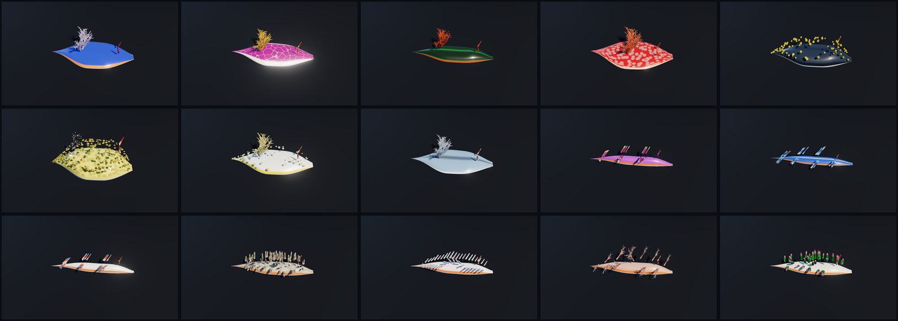

# 🐌 Nudibranchs — a parametric sea slug

A real-time, biologically-grounded **nudibranch** in Three.js. One procedural rig
spans **Chromodoris → Hypselodoris → Nembrotha → Spanish dancer → Phyllidia → sea
bunny → Cadlina → aeolids (blue dragon, Cratena, shag-rug) → Dendronotus → the leaf
sheep** — dorids, aeolids, dendronotids, and a sacoglossan cousin — and every one is
the same rig at a different point in one parameter space.

Nudibranchs are the colour champions of the sea, and their beauty is **pattern and
colour** far more than silhouette. So this rig treats a nudibranch as what it is: a
soft body gliding on a substrate, carrying a **superset field of dorsal appendages**,
wrapped in a **procedural pattern stack**. Move through the space and a broad, flat,
gill-crowned dorid morphs continuously into an elongate, cerata-encrusted aeolid.



*All fifteen are the same rig at different coordinates. Regenerate with
`npm run render` while the server runs.*

## Run it

```bash
npm install      # three + lil-gui
npm start        # static server on http://localhost:5185
```

Orbit with the mouse; tap a species chip; open **controls** to move through the
space by hand. No build step — the browser loads ES modules directly.

```bash
npm run smoke    # Node: builds every species' geometry, checks for NaNs
npm run render   # headless Chromium: screenshots every species to examples/
npm run build    # bundle a self-contained dist/ (content-hashed, no stale pages)
```

## The idea (one axis up from the siphonophore)

The siphonophore's unlock was "an ordered chain of modules along a **stem**" (1-D).
The nudibranch's is one dimension up: **a body-axis curve carrying a parametrized
field of appendages over a surface** (u = along the body, v = across it). Two design
rules make the morphs survive the clade boundaries — which is the whole point:

- **The dorsal field is a SUPERSET, not a switch.** The gill rosette, the ceras
  field, dendritic branches, and surface bumps are *all always present* at some
  `amount` — most at zero for any given animal. Clade = which amounts are nonzero. A
  dorid→aeolid morph fades the rosette out as the cerata fade in, instead of snapping
  across a topology change.
- **One recursive appendage primitive drives everything.** `appendage(spec)` is a
  tapered tube with cross-section shape, curl, inflation, transverse ribs, a tip node,
  colour-along-length (base → gut-coloured core → tip), and recursive child branches.
  Cerata, gill pinnules, rhinophore clubs, dendritic branches, and surface bumps are
  all *this* at different specs. Placed over the notum by `place(u,v)` in ring /
  rows / clusters / scatter modes.

## Colour & pattern — the identity

A stack of procedural layers in body-UV, injected into the diffuse colour before
lighting (so they follow and morph with the body):

- **base fill** + **countershading**
- a contrasting **mantle-margin band** (blue body + orange rim, etc.)
- **spots** (cellular/Worley) and **reticulation** (Voronoi net) — the magenta-and-
  white *Hypselodoris* net, the sea-bunny's black flecks
- **longitudinal lines** (the striped chromodorids)
- and per-appendage **gut-coloured cores + cnidosac tips** — the orange-cored,
  blue-tipped cerata of *Cratena* are the single most "alive" detail.

Rendering thesis, deliberately **opposite** to the siphonophore blackwater void:
these are opaque, saturated, wet animals on a lit reef. Opaque physical PBR + a
strong clearcoat "mucus" glaze + a subsurface term concentrated in the translucent
appendage tips, lit by a warm key (a diver's torch) with a cool fill. They don't
glow — they **gleam**.

## How it's built

```
src/
  core/
    math.js       superellipse, smoothstep, RNG, lerpTree/clone
    sdf.js        SDF primitives + exp-smin + marching tetrahedra (see note below)
    params.js     THE parameter space: superset dorsal field, appendage/field helpers
  species/
    presets.js    15 real specimens as points in that space
  rig/
    body.js       the swept-mesh body (flattened dorid disc ↔ elongate aeolid) + body-UV
    appendage.js  the one recursive appendage generator (tube + ribs + tip + branches)
    dorsalField.js  place(u,v) over the notum: ring / rows / clusters / scatter
    NudibranchRig.js  assembles body + dorsal field + rhinophores; motion in update()
  shading/
    NudiMaterial.js  the pattern stack (onBeforeCompile) + wet PBR + swaying appendages
  scene/
    environment.js   the lit reef substrate + dive-light rig
  main.js         renderer, camera, GUI, species chips, render loop
```

### A note on geometry (SDF vs swept mesh)

The design called for **SDF metaballs + marching cubes** for smooth organic surfacing
(so appendages flow out of the flesh with no seam). `core/sdf.js` implements exactly
that — bounded exponential-smin splatting + marching tetrahedra + vertex merging — and
it's kept for future tubercled species. But in practice a **clean swept-mesh body**
(the proven fish/siphonophore technique) gave a smoother, 100× faster result (2 ms vs
~1.8 s per rebuild) and reliable body-UVs for the pattern stack, so the shipped body
uses that, with appendages attached as meshes. The right tool won on the merits; the
SDF path remains in the repo. (See the devlog for the full story.)

## The biology (and where it came from)

Morphology and colour are synthesised from the research pass — the **Sea Slug Forum /
Bill Rudman**, **WoRMS**, the **Australian Museum**, and species literature. Key
facts baked in: dorids carry a retractile gill rosette around the anus + lamellate
rhinophores; aeolids carry cerata with a **diet-coloured digestive-gland core** and an
opaque/blue **cnidosac tip**; Phyllidiidae have *no* dorsal gill (hard tubercles
instead); *Glaucus* is countershaded blue/silver; *Jorunna*'s "fur" is dense
caryophyllidia. A rendering rule from a 2025 study of guanine photonic structures:
model **blue/white/opalescent as structural** (glossy, view-dependent) and
**yellow/orange/red/black as flat pigment**.

Honest caveats (flagged in research): the *Elysia*/*Costasiella* "leaf slugs" are
**Sacoglossa**, cousins not true nudibranchs (marked ✻); and reaction-diffusion /
cellular pattern generators are an apt *visual analogy* for nudibranch skin, not a
demonstrated biological mechanism (they're established for mollusc *shells*).

## Where it's going

See [`ROADMAP.md`](ROADMAP.md). Near-term: richer per-species pattern tuning, the
Spanish-dancer swim (mantle-margin undulation), Melibe's oral hood, a genome-in-URL
codec (a slug already *is* its parameter tree), and revisiting the SDF path for the
truly lumpy species. Sibling of the **fish**, **flowers**, **fruit**, and
**siphonophore** parametric visualizers.
